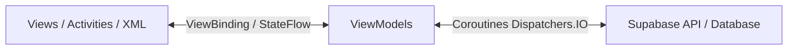

# DOKUMEN TEKNIS & SPESIFIKASI APLIKASI
## ABSENSI PEGAWAI PT. CAREFASTINDO INDONESIA

Dokumen ini disusun sebagai dokumentasi teknis resmi untuk pengembangan aplikasi **Absensi Pegawai PT. Carefastindo Indonesia V1.0.0 (Build Release)**. Aplikasi ini dirancang dan dikembangkan sebagai bagian dari Tugas Akhir (Skripsi) untuk memenuhi syarat kelulusan jenjang Strata-1 (S1) Teknik Informatika di **Universitas Potensi Utama**.

---

## 🚀 1. Latar Belakang & Kolaborasi AI (Artificial Intelligence)
Aplikasi ini dikembangkan secara modern dengan memanfaatkan sinergi teknologi kecerdasan buatan (*Artificial Intelligence*) terdepan untuk merancang arsitektur, basis data, hingga eksekusi baris kode secara presisi:
1. **Ide & Alur Kerja (Workflow):** Konsep bisnis, rancangan alur presensi, penanganan shift kerja, dan diagram alur fitur dioptimalkan melalui rancangan **Deepseek**.
2. **Database & Backend Services:** Seluruh manajemen data, autentikasi pengguna, penyimpanan berkas, dan relasi tabel didukung secara real-time oleh **Supabase**.
3. **Coding & Generate Action (Developer Engine):** Eksekusi penulisan kode Kotlin, perancangan tata letak XML, penyelesaian eror kompilasi Gradle, hingga integrasi antarmuka diproduksi dan diselesaikan secara tuntas oleh **Antigravity AI (Google DeepMind)**.

---

## 🛠️ 2. Spesifikasi Teknologi & Bahasa Pemrograman

### A. Core Platform & Bahasa
*   **Bahasa Pemrograman:** Kotlin Native (100% Android SDK Modern).
*   **Target Android SDK:** Android SDK 33 (Target Android 13/14) dengan dukungan kompatibilitas mundur.
*   **Sistem Bangun (Build System):** Gradle Kotlin DSL dengan Kotlin Compiler `2.0.0`.

### B. Antarmuka Pengguna (UI/UX)
*   **Bahasa Desain:** Material Design 3 (Google Enterprise Standard).
*   **Layout Engine:** XML Layouts dengan arsitektur **ViewBinding** (Tanpa `findViewById` untuk performa cepat dan bebas kebocoran memori).
*   **Komponen Premium:** `CoordinatorLayout`, `NestedScrollView`, `CardView` (melengkung `20dp` dengan bayangan `4dp`), `DrawerLayout` (Bilah Navigasi Samping), dan penanganan notch/bilah status modern melalui fitur `fitsSystemWindows="true"`.

### C. Libraries & SDK Utama
*   **Koneksi Backend:** Supabase Kotlin SDK (v3.0.0+) dengan Ktor HTTP Client (`3.0.1`) untuk performa jaringan asinkron.
*   **Asynchronous Processing:** Kotlin Coroutines & Flow (`StateFlow` & `SharedFlow`) untuk arsitektur berbasis data dinamis.
*   **Lokasi & Keamanan:** Google Play Services Location API (untuk penentuan koordinat presisi tinggi) dan Google ML Kit Barcode Scanning (untuk pemindaian cepat QR Code kantor).
*   **Pembuat Dokumen:** iText 7 PDF Library (untuk pembentukan slip gaji dinamis dari sisi aplikasi).

---

## 🏗️ 3. Arsitektur Perangkat Lunak (Software Architecture)

Aplikasi ini menggunakan pola arsitektur **MVVM (Model-View-ViewModel)** dengan pemisahan tugas (*Separation of Concerns*) yang sangat ketat:

### Komponen Arsitektur:
1.  **View Layer (Activity/Fragment):** Hanya bertanggung jawab menampilkan antarmuka dan menangkap interaksi pengguna (ViewBinding murni).
2.  **ViewModel Layer:** Menangani logika presentasi, mempertahankan keadaan antarmuka (*UI State*), dan berinteraksi dengan Supabase melalui cakupan `viewModelScope` di thread latar belakang (`Dispatchers.IO`).
3.  **Business Logic Layer (`ShiftHelper.kt`):** Kelas utilitas khusus yang diisolasi untuk memproses aturan shift (Pagi, Siang, Malam), toleransi keterlambatan, dan validasi absensi secara independen.
4.  **Database & Storage Layer (Supabase):** Menyimpan seluruh data relasional PostgreSQL dan berkas fisik bukti izin serta PDF slip gaji secara aman.

---

## 🌟 4. Fitur-Fitur Utama Aplikasi

### A. Fitur Pegawai (Employee Workspace)
*   **Autentikasi Aman:** Login akun dan pemulihan kata sandi langsung terkirim ke email masing-masing pegawai (*Forgot Password integration*).
*   **Dashboard Interaktif:** Menampilkan jam digital real-time, sisa kuota keterlambatan bulanan, serta tombol tindakan besar dengan efek riak material (*ripple effect*).
*   **Presensi Geofencing & QR:** Pemindaian QR Code kantor dikombinasikan dengan verifikasi jarak GPS (harus berada dalam radius meter yang telah ditentukan dari titik koordinat kantor).
*   **Manajemen Istirahat:** Pencatatan waktu mulai dan selesai istirahat kerja secara presisi.
*   **Pengajuan Izin & Sakit:** Pengisian form disertai pengambil dokumen bukti fisik yang diunggah langsung ke *Supabase Storage Public Bucket*.
*   **Riwayat Presensi:** Tampilan daftar riwayat masuk, istirahat, dan pulang harian secara transparan.
*   **Tentang Aplikasi:** Halaman profil akademik developer, informasi dosen pembimbing/penguji, foto berbingkai melingkar, serta disclaimer lisensi tugas akhir.

### B. Fitur Super Admin & Supervisor
*   **Dashboard Ringkasan (Real-time Stats):** Grafik visual dan kartu counter otomatis (Hadir, Sakit, Izin, Off, Lembur) hari ini.
*   **Rekap Absensi:** Data grid interaktif untuk melacak riwayat presensi seluruh pegawai secara harian.
*   **Verifikasi Izin:** Peninjauan dokumen bukti izin/sakit pegawai secara visual dengan tombol tindakan instan *Approve* (Setujui) atau *Reject* (Tolak).
*   **Manajemen Karyawan (CRUD):** Tambah pegawai baru (auto-generate kode pegawai unik 6-digit), edit data, ganti hak akses/role, dan reset kuota keterlambatan bulanan.
*   **Penjadwalan Hari Off & Lembur:** Pengaturan hari libur mingguan pegawai serta tugas darurat/lembur di tanggal tertentu.
*   **Generator Slip Gaji (PDF Creator):** Form perhitungan gaji pokok, tunjangan, potongan terlambat, pembentukan berkas PDF (iText 7), pengunggahan otomatis ke *secure bucket* Supabase, serta fitur unduh/bagikan slip langsung dari aplikasi.
*   **Pengaturan Kantor & Google Maps:** Antarmuka peta interaktif untuk menentukan koordinat utama kantor, set radius batas absensi (meter), dan atur toleransi waktu shift.

---

## 📂 5. Struktur Database Supabase (PostgreSQL Schema)

*   **`users`**: Informasi identitas pengguna, hak akses (`employee`, `superadmin`, `spv`), shift kerja aktif, kode pegawai, dan status aktif.
*   **`attendance`**: Log harian presensi masuk, istirahat, pulang, koordinat lokasi absensi, status keterlambatan, dan catatan.
*   **`leave_requests`**: Berkas pengajuan izin/sakit beserta tautan berkas unggahan bukti fisik.
*   **`off_schedules`**: Jadwal hari libur rutin mingguan/bulanan per pegawai.
*   **`emergency_assignments`**: Tugas kerja darurat/lembur di luar hari kerja standar.
*   **`company_config`**: Pengaturan global koordinat kantor, radius absensi, dan jam masuk/pulang.
*   **`salary_slips`**: Catatan historis slip gaji bulanan pegawai beserta tautan PDF slip yang aman.

---
*Dokumen ini dibuat secara resmi untuk mendampingi berkas kompilasi kode proyek Absensi Carefastindo.*
*© 2026 M. Juffri Siregar. All Rights Reserved.*
