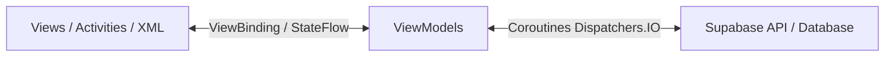
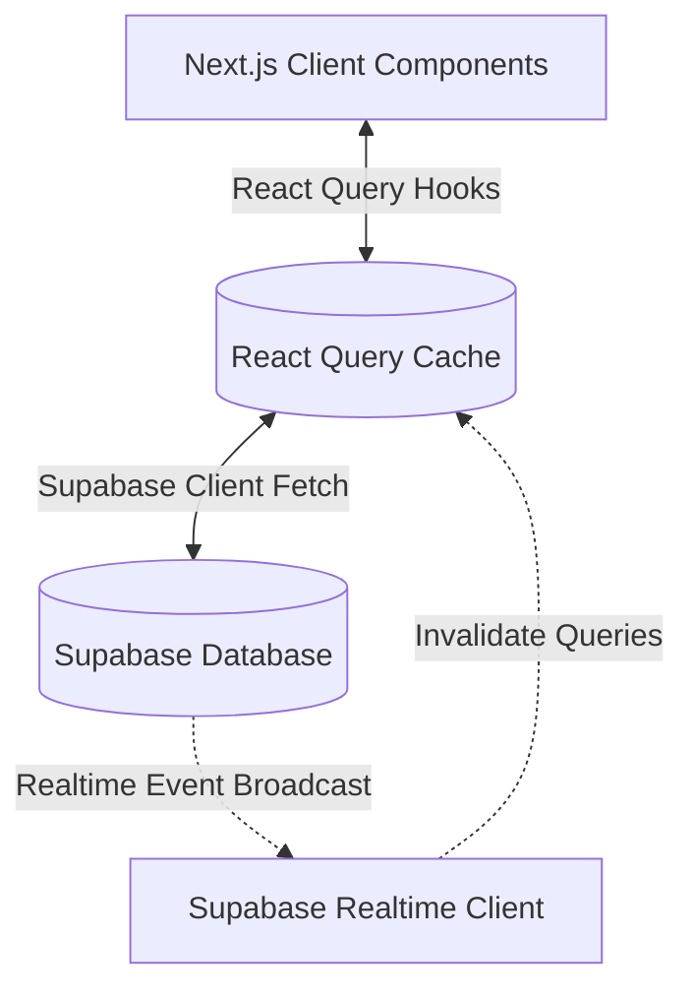
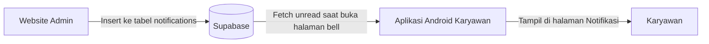

# DOKUMEN TEKNIS & SPESIFIKASI PROYEK
## SISTEM ABSENSI PEGAWAI PT. CAREFASTINDO INDONESIA
### (ANDROID APP & WEBSITE ADMIN PANEL)

Dokumen ini disusun sebagai dokumentasi teknis resmi untuk pengembangan sistem **Absensi Pegawai PT. Carefastindo Indonesia V1.1.0 (Build Release)** yang mencakup aplikasi mobile Android (khusus Pegawai) dan Website Admin Panel (khusus Super Admin).

Aplikasi ini dirancang dan dikembangkan sebagai bagian dari Tugas Akhir (Skripsi) untuk memenuhi syarat kelulusan jenjang Strata-1 (S1) Teknik Informatika di **Universitas Potensi Utama**.

---

## 📂 1. Struktur Folder Proyek
Untuk memastikan keamanan dan mencegah kerusakan kode lama, proyek ini dipisahkan menjadi dua folder mandiri:
```
absensi_carefastindo/
├── android/          ← Seluruh kode asli aplikasi Android (Mobile App Pegawai)
├── website/          ← Seluruh kode website admin panel Next.js (Admin Workspace)
└── README.md         ← Dokumen panduan utama ini
```

---

## 🛠️ 2. Spesifikasi Teknologi

### A. Aplikasi Android (`/android`)
Aplikasi mobile native yang digunakan oleh pegawai untuk melakukan presensi secara langsung di lapangan.
*   **Bahasa Pemrograman:** Kotlin Native (100% Android SDK Modern).
*   **Target Android SDK:** Android SDK 33 (Target Android 13/14).
*   **Sistem Bangun:** Gradle Kotlin DSL dengan Kotlin Compiler `2.0.0`.
*   **Layout Engine:** XML Layouts dengan arsitektur **ViewBinding**.
*   **Library Utama:** Supabase Kotlin SDK, Google Play Services Location API (Geofencing), Google ML Kit Barcode Scanning (QR Scanner), dan iText 7.

### B. Website Admin Panel (`/website`)
Dashboard web yang digunakan oleh Super Admin untuk memantau kehadiran, mengelola jadwal shift, pengumuman, permohonan cuti, laporan vendor, serta generate QR Code.
*   **Framework Utama:** Next.js 14 (App Router) + TypeScript + Tailwind CSS.
*   **Design System:** shadcn/ui (slate/white dengan aksen biru soft).
*   **Data Fetching:** **TanStack Query (React Query) v5** dengan caching, auto-refresh, dan skeleton loading.
*   **Realtime Sync:** **Supabase Realtime (Postgres Changes)** untuk memantau data absensi secara instan tanpa reload halaman.
*   **Animasi:** **Framer Motion** untuk transisi perpindahan halaman, efek rendering modal detail, dan micro-interactions pada tombol.
*   **Visualisasi:** **Chart.js** & `react-chartjs-2` untuk grafik mingguan & donut chart harian.
*   **Dokumen & Ekspor:** **pdfmake** (untuk generate file PDF) & **xlsx** (untuk generate file Excel).

---

## 🏗️ 3. Arsitektur Perangkat Lunak & Alur Kerja

### A. Aplikasi Android (MVVM Pattern)


### B. Website Admin Panel (React Query + Realtime Pattern)


### C. Alur Notifikasi (Website → Android)


---

## 📂 4. Skema Database Supabase (PostgreSQL Schema)
Berikut adalah daftar tabel database relasional yang digunakan oleh sistem absensi (Pegawai & Admin):

1.  **`users`**: Identitas lengkap pengguna (ID, nama, email, password, role seperti `superadmin`, `supervisor`, `leader`, `cleaner`, `housekeeping`, `gardener`, `gondola`). Memiliki kolom `lateness_count` untuk tracking akumulasi keterlambatan bulanan.
2.  **`attendance`**: Log harian presensi masuk, istirahat, pulang, koordinat lokasi absensi (GPS), foto selfie, status kehadiran (`hadir`, `terlambat`, `izin`, `sakit`, `alfa`, `cuti`), dan catatan admin.
3.  **`leave_requests`**: Berkas pengajuan cuti, sakit, atau izin pegawai beserta alasan dan bukti lampiran file pendukung.
4.  **`shifts`**: Master data shift kerja (ID, nama shift, `start_time`, `end_time`, status aktif).
5.  **`user_shifts`**: Relasi penugasan shift harian/mingguan pegawai beserta tanggal efektif berlaku dan `shift_type` (`single`, `double`, `off`).
6.  **`overtime_assignments`**: Penugasan lembur pegawai oleh admin/supervisor, beserta status, jam lembur aktual, dan keterangan.
7.  **`emergency_assignments`**: Penugasan darurat (lembur mendadak & ganti off) antar-pegawai dengan field `reason` (`lembur` / `ganti_off`) dan relasi ke pegawai pengganti.
8.  **`notifications`**: Notifikasi personal per-karyawan yang dikirim otomatis saat admin melakukan perubahan (ubah shift, assign lembur, ganti off, ganti password). Memiliki kolom `is_read` dan di-reset otomatis setiap awal bulan.
9.  **`qr_code_logs`**: Log historis data QR Code presensi yang dihasilkan sistem beserta waktu generate dan masa kedaluwarsa (berlaku 30 menit).
10. **`announcements`**: Pengumuman broadcast yang dikirim oleh superadmin yang bisa ditargetkan per-role atau ke seluruh pegawai.
11. **`announcement_reads`**: Tracking status baca pengumuman per-user.
12. **`settings`**: Konfigurasi global perusahaan (`companyConfig`) termasuk koordinat kantor, radius geofence (meter), dan jam kerja default.
13. **`contracts`**: Informasi kontrak kerja pegawai (nomor kontrak, tanggal mulai, tanggal berakhir, dan status keaktifan).
14. **`payrolls`**: Rekap slip gaji bulanan pegawai beserta total perhitungan gaji pokok, potongan keterlambatan, dan tunjangan.

---

## 🌟 5. Fitur Utama Sistem

### A. Aplikasi Android (Employee Workspace)
*   **Autentikasi Aman:** Login dan integrasi lupa kata sandi langsung ke email pegawai.
*   **Dashboard Kehadiran:** Menampilkan status kehadiran hari ini, jam digital, kuota keterlambatan, dan tombol riak (*ripple effect*).
*   **Presensi Double Verification:** Verifikasi pemindaian QR Code kantor dan Geofencing koordinat GPS pegawai.
*   **Bukti Lampiran Izin:** Form pengajuan izin/sakit langsung mengunggah file bukti fisik ke *Supabase Storage Public Bucket*.
*   **Halaman Notifikasi (Bell):** Menampilkan semua notifikasi personal dari admin (ubah shift, lembur, ganti off, ganti password) digabung dengan pengumuman umum perusahaan. Pesan langsung terlihat penuh tanpa perlu tap. Notifikasi di-reset otomatis setiap awal bulan baru.
*   **Card Admin Notification:** Preview notifikasi terbaru yang belum dibaca tampil langsung di halaman utama dashboard.

### B. Website Admin Panel (Admin Management Hub)
*   **Dashboard Desktop-Like:** Grafik trend mingguan, donut chart persentase harian, realtime counter statistik (Hadir, Izin, Sakit, Alfa), dan tabel 5 data log absensi terakhir.
*   **Attendance Board:** Filter multi-kolom dengan label "FILTER:" (tanggal, shift, status, nama), focus ring biru pada semua input saat diklik, modal detail absensi (lokasi GPS & foto selfie), serta download laporan PDF & Excel.
*   **Edit Absensi dengan Auto-Recalculate Status:** Admin dapat mengubah jam masuk, jam pulang, jam istirahat karyawan. Status (`hadir`/`terlambat`) dihitung ulang secara otomatis berdasarkan jam masuk baru vs `start_time` shift (toleransi 30 menit). Counter `lateness_count` di tabel `users` ikut dikoreksi otomatis.
*   **Shift & User Setup:** Pengaturan shift aktif pegawai, log riwayat pergantian shift, penugasan lembur, pengaturan hari off, dan ganti off antar-karyawan.
*   **Notifikasi Otomatis ke Karyawan:** Setiap aksi admin secara otomatis mengirim notifikasi ke aplikasi Android karyawan yang bersangkutan:
    *   Ubah shift → *"Admin mengubah jadwal shift kerja kamu..."*
    *   Assign lembur → *"Ada tugas baru buat kamu, yaitu "Lembur"..."*
    *   Ganti off → *"Permintaan mu untuk ganti off dengan rekan kerja telah di perbaharui..."*
    *   Ganti password → *"Admin telah memperbaharui password akun anda..."*
*   **QR Generator:** Generate QR Code dinamis dengan durasi kedaluwarsa 30 menit + countdown timer.
*   **Announcements Broadcast:** Pengiriman pengumuman tertarget per-role atau all-employee dengan status persentase pembacaan.
*   **Reports Export:** 4 modul pelaporan independen (Harian, Bulanan, Vendor, Kontrak) dengan ekspor instan Excel & PDF.
*   **Leave Requests Panel:** Verifikasi permohonan cuti, sakit, dan izin pegawai dengan tombol persetujuan cepat serta bulk-actions (Approve/Reject All) yang dilengkapi konfirmasi dialog keamanan.
*   **Konfigurasi Kantor:** Pengaturan koordinat GPS kantor, radius geofence, dan jam kerja default melalui modal pengaturan.

---

## 🔄 6. Alur Data Real-time (Android ↔ Website)

| Aksi | Arah | Mekanisme |
|------|------|-----------|
| Karyawan absen masuk/pulang | Android → Supabase → Website | Insert ke `attendance`, website subscribe via Realtime |
| Admin ubah jam absen | Website → Supabase → (Android baca saat refresh) | Update `attendance`, status auto-recalculate |
| Admin ubah shift | Website → Supabase → Android | Insert `user_shifts` + insert `notifications` |
| Admin assign lembur | Website → Supabase → Android | Insert `overtime_assignments` + insert `notifications` |
| Admin set ganti off | Website → Supabase → Android | Insert `emergency_assignments` + insert `notifications` |
| Admin ganti password | Website → Supabase → Android | API `update-password` + insert `notifications` |
| Karyawan terlambat 3x | Android → Supabase | Insert `notifications` ke superadmin |

---

## 🚀 7. Cara Menjalankan Project

### A. Menjalankan Aplikasi Android (`/android`)
1.  Buka folder `android/` menggunakan **Android Studio**.
2.  Lakukan sinkronisasi Gradle (Gradle Sync) dan pastikan semua dependencies terunduh dengan benar.
3.  Hubungkan perangkat Android fisik atau Emulator.
4.  Klik tombol **Run 'app'**.

### B. Menjalankan Website Admin Panel (`/website`)
1.  Buka terminal Anda dan masuk ke folder website:
    ```bash
    cd website
    ```
2.  Pastikan berkas `.env.local` telah terkonfigurasi dengan Supabase URL dan Anon Key Anda.
3.  Jalankan server pengembangan lokal:
    ```bash
    npm run dev
    ```
4.  Buka browser Anda dan akses halaman `http://localhost:3000`.

### C. Build APK via GitHub Actions
1.  Push semua perubahan ke branch `main`.
2.  Buka tab **Actions** di repository GitHub.
3.  Pilih workflow **"Build Android APK"** → klik **"Run workflow"**.
4.  Setelah selesai, APK tersedia di tab **Artifacts** dengan nama `absensi-carefastindo-apk`.

---

## 📝 8. Changelog

### V1.1.0
*   **[BARU] Sistem Notifikasi Personal:** Notifikasi otomatis dikirim ke Android karyawan saat admin mengubah shift, assign lembur, set ganti off, atau mengubah password. Notifikasi tampil di halaman bell dan di-reset setiap awal bulan.
*   **[BARU] Edit Absensi dengan Auto-Recalculate:** Status `hadir`/`terlambat` dihitung ulang otomatis saat admin mengubah jam masuk. `lateness_count` karyawan ikut dikoreksi.
*   **[BARU] Halaman Notifikasi Terpadu:** Bell di Android sekarang menampilkan notifikasi admin + pengumuman umum dalam satu halaman. Semua pesan langsung terlihat penuh.
*   **[PERBAIKAN] Focus Ring Biru:** Semua input dan select di website tampil dengan border biru saat diklik (bukan hanya keyboard).
*   **[PERBAIKAN] Layout Filter Absensi:** Semua filter (tanggal, shift, status, pencarian, tombol reset) sejajar dalam satu baris dengan label "FILTER:".

### V1.0.0
*   Rilis awal sistem absensi dengan fitur dasar Android dan Website Admin Panel.

---
*M. Juffri Siregar — Universitas Potensi Utama*
